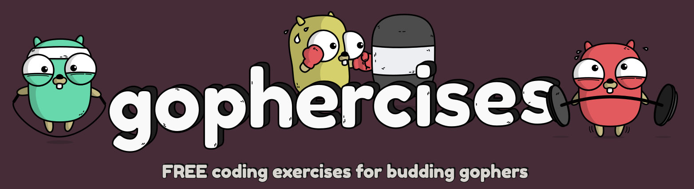

<h1 align="center" style="border-bottom: none; margin-bottom: 0;">
    <a href="https://gophercises.com/">Gophercises</a>: By <a href="https://github.com/Blenderwizard">Jolan "Blenderwizard" Rathelot</a>
</h1>

	

## What is this ?

Gophercises exercises solutions from [https://gophercises.com/](https://gophercises.com/).

Gophercises is a free online course to learn golang, offering simple projects to learn Golang.